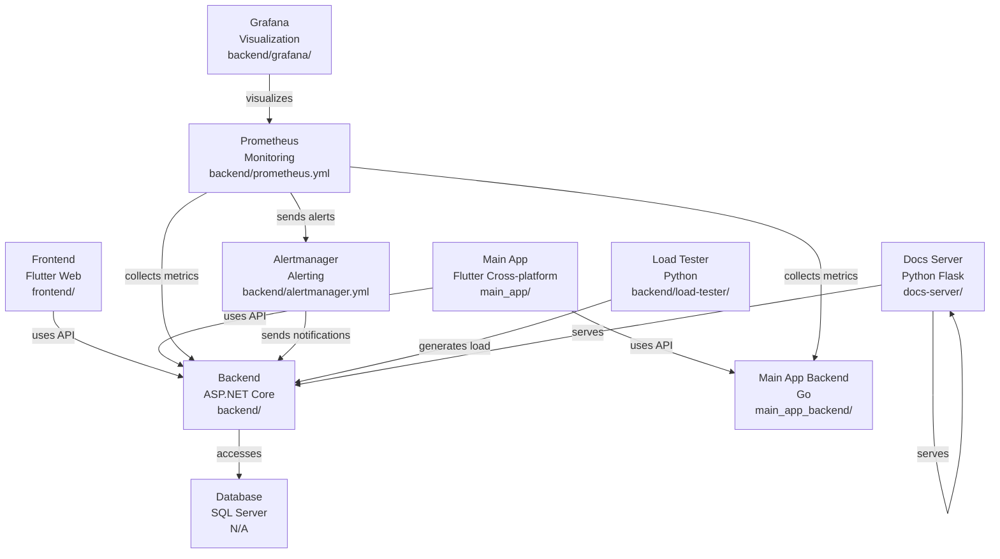
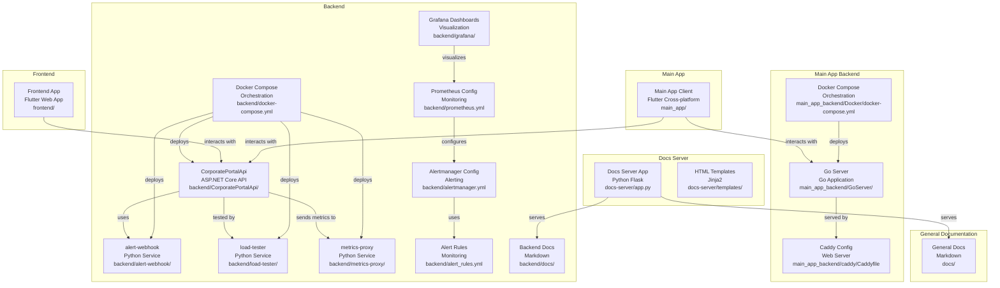

# Codebase Research Report

## Query
напиши текстовое описание для этого всего

## Answer
# Обзор Проекта Simple-Port

Проект **Simple-Port** представляет собой комплексное решение, включающее в себя несколько взаимосвязанных компонентов для управления корпоративным порталом, мониторинга, тестирования нагрузки и предоставления документации. Архитектура проекта разделена на несколько основных частей: основной бэкенд, основной фронтенд, сервер документации, а также вспомогательные сервисы для мониторинга и тестирования.

## Высокоуровневая Архитектура

Проект состоит из следующих ключевых компонентов:

*   **Backend**: Основной API-сервер, разработанный на ASP.NET Core, предоставляющий бизнес-логику и доступ к данным.
*   **Frontend**: Веб-приложение, разработанное на Flutter, взаимодействующее с основным бэкендом.
*   **Main App**: Кроссплатформенное приложение (мобильное/десктопное), также разработанное на Flutter, вероятно, для более широкого спектра устройств.
*   **Main App Backend**: Отдельный бэкенд, предположительно на Go, который может обслуживать `main_app` или выполнять специфические задачи.
*   **Docs Server**: Сервер на Python для хостинга и отображения документации.
*   **Мониторинг и Тестирование**: Включает Prometheus, Grafana, Alertmanager, а также сервисы для тестирования нагрузки и обработки алертов.

Взаимодействие между компонентами происходит преимущественно через HTTP/HTTPS API. Бэкенд-сервисы используют базы данных, а мониторинговые инструменты собирают метрики и логи.

## Компоненты Проекта

### **Backend**

Основной бэкенд-компонент, расположенный в директории [backend/](backend/), содержит API-сервер и связанные с ним сервисы для мониторинга и оповещений.

*   **CorporatePortalApi**: Основное ASP.NET Core API-приложение, расположенное в [backend/CorporatePortalApi/](backend/CorporatePortalApi/). Оно предоставляет основные функции корпоративного портала.
    *   **Назначение**: Обработка запросов, управление данными, реализация бизнес-логики.
    *   **Внутренние части**: Включает контроллеры ([backend/CorporatePortalApi/Controllers/](backend/CorporatePortalApi/Controllers/)), модели данных ([backend/CorporatePortalApi/Models/](backend/CorporatePortalApi/Models/)), сервисы ([backend/CorporatePortalApi/Services/](backend/CorporatePortalApi/Services/)) и контексты данных ([backend/CorporatePortalApi/Data/](backend/CorporatePortalApi/Data/)).
    *   **Внешние связи**: Взаимодействует с базой данных (предположительно SQL Server, исходя из названия `SqlBatchRequestsMonitorService.cs` в [backend/CorporatePortalApi/SqlBatchRequestsMonitorService.cs](backend/CorporatePortalApi/SqlBatchRequestsMonitorService.cs)) и предоставляет API для фронтенда.
*   **alert-webhook**: Сервис на Python, расположенный в [backend/alert-webhook/](backend/alert-webhook/).
    *   **Назначение**: Обработка вебхуков от Alertmanager, вероятно, для отправки уведомлений в различные системы.
*   **load-tester**: Сервис на Python, расположенный в [backend/load-tester/](backend/load-tester/).
    *   **Назначение**: Инструмент для генерации нагрузки на API-серверы, используемый для тестирования производительности.
*   **metrics-proxy**: Сервис на Python, расположенный в [backend/metrics-proxy/](backend/metrics-proxy/).
    *   **Назначение**: Проксирование или агрегация метрик перед их отправкой в систему мониторинга.
*   **Мониторинг**: Конфигурационные файлы для Prometheus ([backend/prometheus.yml](backend/prometheus.yml)), Alertmanager ([backend/alertmanager.yml](backend/alertmanager.yml)) и правила алертов ([backend/alert_rules.yml](backend/alert_rules.yml)).
    *   **Назначение**: Сбор метрик, оповещение о проблемах и визуализация данных через Grafana ([backend/grafana/](backend/grafana/)).
*   **Документация**: В директории [backend/docs/](backend/docs/) содержится документация, специфичная для бэкенда, включая [API_Documentation.md](backend/docs/API_Documentation.md) и [Monitoring_Guide.md](backend/docs/Monitoring_Guide.md).
*   **Docker Compose**: Файл [backend/docker-compose.yml](backend/docker-compose.yml) определяет и запускает все эти сервисы в контейнерах.

### **Frontend**

Веб-приложение, расположенное в директории [frontend/](frontend/).

*   **Назначение**: Предоставление пользовательского интерфейса для взаимодействия с **CorporatePortalApi**.
*   **Технология**: Разработано на Flutter, что подтверждается файлами [frontend/pubspec.yaml](frontend/pubspec.yaml), [frontend/.dart_tool/](frontend/.dart_tool/) и структурой директории [frontend/lib/](frontend/lib/) (например, [frontend/lib/main.dart](frontend/lib/main.dart), [frontend/lib/login.dart](frontend/lib/login.dart)).
*   **Внутренние части**: Включает основные виджеты, логику входа ([frontend/lib/login.dart](frontend/lib/login.dart)), сервисы ([frontend/lib/services/](frontend/lib/services/)) для взаимодействия с API и компоненты пользовательского интерфейса ([frontend/lib/user_category/](frontend/lib/user_category/)).
*   **Внешние связи**: Взаимодействует с **CorporatePortalApi** через HTTP-запросы.

### **Main App**

Кроссплатформенное приложение, расположенное в директории [main_app/](main_app/).

*   **Назначение**: Вероятно, это основное клиентское приложение, предназначенное для различных платформ (мобильные, десктопные).
*   **Технология**: Также разработано на Flutter, о чем свидетельствуют файлы [main_app/pubspec.yaml](main_app/pubspec.yaml) и наличие специфичных для платформ директорий ([main_app/android/](main_app/android/), [main_app/ios/](main_app/ios/), [main_app/linux/](main_app/linux/), [main_app/macos/](main_app/macos/), [main_app/windows/](main_app/windows/)).
*   **Внутренние части**: Аналогично `frontend`, содержит логику входа ([main_app/lib/login.dart](main_app/lib/login.dart)), основной файл приложения ([main_app/lib/main.dart](main_app/lib/main.dart)) и компоненты пользовательского интерфейса ([main_app/lib/user_category/](main_app/lib/user_category/)).
*   **Внешние связи**: Предположительно, взаимодействует с **CorporatePortalApi** или **Main App Backend**.

### **Main App Backend**

Отдельный бэкенд-компонент, расположенный в директории [main_app_backend/](main_app_backend/).

*   **Назначение**: Может служить специализированным бэкендом для `main_app` или выполнять другие серверные функции.
*   **Технология**: Содержит директорию [main_app_backend/GoServer/](main_app_backend/GoServer/), что указывает на использование Go в качестве основного языка.
*   **Внутренние части**: Включает конфигурацию Caddy ([main_app_backend/caddy/Caddyfile](main_app_backend/caddy/Caddyfile)) для проксирования или обслуживания статических файлов, а также Docker-конфигурации ([main_app_backend/Docker/docker-compose.yml](main_app_backend/Docker/docker-compose.yml)).
*   **Внешние связи**: Может взаимодействовать с `main_app` и/или другими внутренними сервисами.

### **Docs Server**

Сервер для документации, расположенный в директории [docs-server/](docs-server/).

*   **Назначение**: Предоставление доступа к документации проекта через веб-интерфейс.
*   **Технология**: Разработан на Python с использованием Flask, о чем свидетельствуют [docs-server/app.py](docs-server/app.py) и [docs-server/requirements.txt](docs-server/requirements.txt).
*   **Внутренние части**: Включает логику приложения ([docs-server/app.py](docs-server/app.py)) и шаблоны HTML ([docs-server/templates/](docs-server/templates/)).
*   **Внешние связи**: Обслуживает статические файлы документации, расположенные в [docs/](docs/) и [backend/docs/](backend/docs/).

### **Общая Документация**

Директория [docs/](docs/) содержит общую документацию проекта, такую как [API_Documentation.md](docs/API_Documentation.md), [Monitoring_Guide.md](docs/Monitoring_Guide.md) и [QUICK_START.md](docs/QUICK_START.md). Эта документация, вероятно, агрегируется и отображается через **Docs Server**.

---
*Generated by [CodeViz.ai](https://codeviz.ai) on 8/30/2025, 2:08:58 PM*
